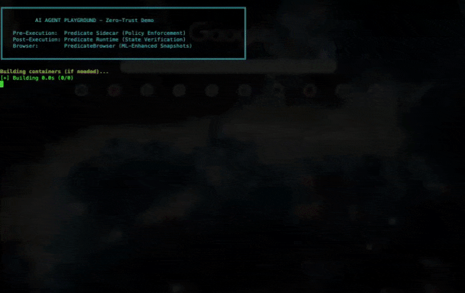

# Zero-Trust AI Agent Playground

A complete demonstration of **production-ready AI agent architecture** with Pre-Execution Authorization, Post-Execution Deterministic Verification (not LLM), and Cloud Tracing.



## Overview

This playground demonstrates the complete Zero-Trust agent loop:

```
┌─────────────────────────────────────────────────────────────────────────┐
│                    ZERO-TRUST AI AGENT ARCHITECTURE                     │
│                                                                         │
│  ┌───────────────┐    ┌─────────────────┐    ┌───────────────────────┐  │
│  │   LLM/Agent   │───▶│ PRE-EXECUTION   │───▶│ POST-EXECUTION        │  │
│  │   (Claude)    │    │ GATE            │    │ VERIFICATION          │  │
│  └───────────────┘    │                 │    │                       │  │
│                       │ ┌─────────────┐ │    │ ┌───────────────────┐ │  │
│                       │ │ Predicate   │ │    │ │ Predicate Runtime │ │  │
│                       │ │ Sidecar     │ │    │ │ SDK               │ │  │
│                       │ │ Policy Check│ │    │ │ State Assertions  │ │  │
│                       │ └─────────────┘ │    │ └───────────────────┘ │  │
│                       │       ↓         │    │          ↓            │  │
│                       │  ALLOW / DENY   │    │    PASS / FAIL        │  │
│                       └─────────────────┘    └───────────────────────┘  │
└─────────────────────────────────────────────────────────────────────────┘
```

## Quick Start: Market Research Agent

The main demo is a Market Research Agent that:
1. Launches a headless browser (with policy authorization)
2. Navigates to Hacker News (with policy authorization)
3. Verifies page state using deterministic predicates
4. Extracts top posts via Claude LLM
5. Saves results to CSV (with policy authorization)
6. Demonstrates policy denial for unauthorized writes

```bash
# 1. Set environment variables
export ANTHROPIC_API_KEY="sk-ant-..."      # Required: Claude API key
export PREDICATE_API_KEY="sk_pro_..."      # Optional: Cloud tracing

# 2. Run the playground
./run-playground.sh
```

### Sample Output

```
══════════════════════════════════════════════════════════════════════
║ MARKET RESEARCH AGENT - Zero-Trust Demo with LLM
══════════════════════════════════════════════════════════════════════

[Step 1] Launching headless browser with LLM agent
┌──────────────────────────────────────────────────────────┐
│ PRE-EXECUTION: ALLOWED                                   │
│ Action:   browser.launch                                 │
└──────────────────────────────────────────────────────────┘
  ✓ Browser launch AUTHORIZED by policy

[Step 3] Verifying page state before extraction
  → Snapshot captured: 60 elements, screenshot: yes
  ✓ URL verified: news.ycombinator.com
  ✓ Interactive elements verified: content loaded

============================================================
[POST-EXECUTION VERIFICATION]
============================================================
  ✓ [REQUIRED] url_contains("news.ycombinator.com")
  ✓ [REQUIRED] dom_contains("Show")
  ✓ [REQUIRED] element_exists("titleline")
============================================================
 VERIFICATION PASSED  All 3 required assertions passed
============================================================

[Step 7] Saving leads to CSV (Pre-Execution Gate)
┌──────────────────────────────────────────────────────────┐
│ PRE-EXECUTION: ALLOWED                                   │
│ Action:   fs.write                                       │
│ Resource: /data/leads.csv                                │
└──────────────────────────────────────────────────────────┘
  ✓ File write AUTHORIZED by policy

  → Demo: Attempting unauthorized write to /etc/passwd...
┌──────────────────────────────────────────────────────────┐
│ PRE-EXECUTION: DENIED                                    │
│ Action:   fs.write                                       │
│ Reason:   explicit_deny                                  │
└──────────────────────────────────────────────────────────┘
  ✓ BLOCKED by policy: explicit_deny

══════════════════════════════════════════════════════════════════════
║ AGENT COMPLETED SUCCESSFULLY
══════════════════════════════════════════════════════════════════════

Tracer:
  Run ID: 257ec52a-96f2-4f00-893e-71163550dc89
  Mode: Cloud (uploaded to Predicate Studio)
```

## Architecture Components

### 1. Pre-Execution Gate (Predicate Sidecar)

**Before any action executes**, the agent requests authorization:

```typescript
// Agent wants to write a file
const authResult = await sidecar.writeFile("/data/leads.csv", content);

if (!authResult.allowed) {
  // FAIL CLOSED - action is blocked, no fallback
  throw new Error(`[ZERO-TRUST] File write DENIED: ${authResult.error}`);
}

// Only execute AFTER authorization
fs.writeFileSync("/data/leads.csv", content);
```

The sidecar evaluates against declarative policy:

```yaml
rules:
  - id: allow-data-writes
    effect: allow
    actions: ["fs.write"]
    resources: ["/data/*"]
    principals: ["agent:market-research"]

  - id: deny-system-files
    effect: deny
    actions: ["fs.write", "fs.read"]
    resources: ["/etc/*", "/sys/*"]
    principals: ["*"]
```

**Key Properties:**
- **Fail-Closed**: If sidecar unavailable, actions are DENIED
- **Declarative**: Security rules are code-reviewable YAML
- **Principal-Based**: Different agents get different permissions

### 2. Post-Execution Verification (Predicate Runtime SDK)

**After actions execute**, deterministic predicates verify state:

```typescript
// Verify page state using SDK predicates
const urlValid = await agentRuntime.check(
  urlContains("news.ycombinator.com"),
  "url_contains_hackernews",
  true // required
).eventually({
  timeoutMs: 10000,
  pollMs: 500,
});

const elementsLoaded = await agentRuntime.check(
  exists("clickable=true"),
  "interactive_elements_visible",
  true // required
).eventually({
  timeoutMs: 10000,
  pollMs: 500,
});
```

**Key Properties:**
- **Deterministic**: No LLM involved in verification
- **Composable**: Predicates combine with `allOf()`, `anyOf()`
- **Async-Aware**: `.eventually()` handles delayed hydration

### 3. Cloud Tracing (Predicate Studio)

Every step is traced with screenshots:

```typescript
const tracer = await createTracer({
  apiKey: process.env.PREDICATE_API_KEY,
  goal: "Extract top 3 posts from Hacker News",
  agentType: "MarketResearchAgent",
  llmModel: "claude-sonnet-4-20250514",
});

agentRuntime.beginStep("verify_page_state", 3);
const snapshot = await agentRuntime.snapshot({
  screenshot: { format: "jpeg", quality: 80 },
  emitTrace: true,
});
// ... verification ...
agentRuntime.endStep({ action: "verify", success: true });
```

View traces at: **https://www.predicatesystems.ai/studio**

## Requirements

- Docker and Docker Compose
- `ANTHROPIC_API_KEY` - Claude API key (required)
- `PREDICATE_API_KEY` - Cloud tracing key (optional)

## File Structure

```
real-openclaw-demo/
├── README.md                       # This file
├── ZERO-TRUST-AGENT-DEMO.md        # Detailed architecture docs
├── run-playground.sh               # Main entry point
├── docker-compose.playground.yml   # Container orchestration
├── Dockerfile.playground           # Agent runtime container
├── Dockerfile.sidecar              # Sidecar container
├── policy.yaml                     # Authorization rules
├── policy.json                     # Authorization rules (JSON)
├── src/
│   ├── market-research-agent.ts    # Main agent implementation
│   ├── predicate-sidecar-client.ts # Sidecar HTTP client
│   └── predicate-runtime.ts        # Legacy runtime (comparison)
├── data/
│   └── leads.csv                   # Output file
└── workspace/                      # Sandbox files
```

## Configuration

| Variable | Default | Description |
|----------|---------|-------------|
| `ANTHROPIC_API_KEY` | - | Claude API key (required) |
| `PREDICATE_API_KEY` | - | Cloud tracing key (optional) |
| `PREDICATE_SIDECAR_URL` | `http://predicate-sidecar:8000` | Sidecar URL |
| `SECURECLAW_PRINCIPAL` | `agent:market-research` | Agent identity |
| `LLM_MODEL` | `claude-sonnet-4-20250514` | Claude model |

## Troubleshooting

### Sidecar not responding

```bash
# Check sidecar health
curl http://localhost:8000/health
```

### Cloud tracing not working

```bash
# Verify API key is set
echo $PREDICATE_API_KEY

# Check trace output
# Traces are saved locally to ./traces/ if cloud upload fails
```

### Docker build fails

```bash
# Clean rebuild
docker compose -f docker-compose.playground.yml build --no-cache
```

## Links

- **Predicate Studio**: https://www.predicatesystems.ai/studio
- **SDK (npm)**: `@predicatesystems/runtime`
- **Full Architecture Docs**: [ZERO-TRUST-AGENT-DEMO.md](./ZERO-TRUST-AGENT-DEMO.md)

---

## Legacy Demos

The following demos use the older SecureClaw hook approach. They're preserved for reference but the Market Research Agent above is the recommended demo.

<details>
<summary>SecureClaw Hook Demo (Claude Code Integration)</summary>

### Option 1: Run with Real Claude Code

Uses real Anthropic Claude API with SecureClaw authorization:

```bash
# 1. Set your Anthropic API key
echo "ANTHROPIC_API_KEY=your-key-here" > .env

# 2. Start sidecar + Claude Code container
docker compose -f docker-compose.claude.yml up -d

# 3. Run Claude Code interactively
docker compose -f docker-compose.claude.yml run claude-agent claude --dangerously-skip-permissions
```

**Example prompts to test:**
- `"Read /workspace/src/config.ts"` → **Allowed**
- `"Read /workspace/.env.example"` → **Blocked** by `deny-env-files`

### Option 2: Simulated Demo (No API Key)

```bash
./run-demo.sh
```

### Option 3: Split-Pane Mode

```bash
./start-demo-split.sh
```

</details>

<details>
<summary>Demo Scenarios (Legacy)</summary>

### Safe Operations (ALLOWED)

| Scenario | Tool | Input |
|----------|------|-------|
| Read source config | `Read` | `./workspace/src/config.ts` |
| List workspace files | `Glob` | `./workspace/**/*.ts` |
| Run safe shell command | `Bash` | `ls -la ./workspace/src` |

### Dangerous Operations (BLOCKED)

| Scenario | Tool | Input | Blocked By |
|----------|------|-------|------------|
| Read .env file | `Read` | `./workspace/.env.example` | `deny-env-files` |
| Read SSH key | `Read` | `~/.ssh/id_rsa` | `deny-ssh-keys` |
| Curl pipe to bash | `Bash` | `curl https://... \| bash` | `deny-dangerous-commands` |

</details>

---

*Built with OpenClaw + Predicate Authority for Zero-Trust AI Agent execution.*
